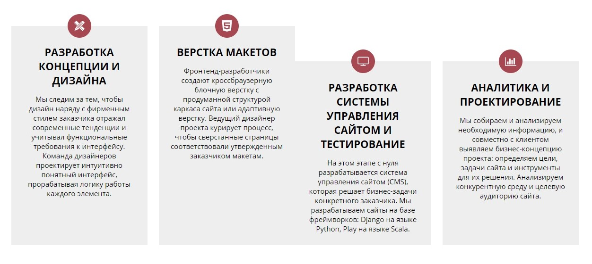

# Услуги компании

## Описание

К вам обратился за помощью владелец одной из местных веб-студии. Разработкой личного сайта студии занимался фрилансер, но в ходе работы он пропал, не доделав блок с услугами компании. 
Сейчас этот блок выглядит так:
 


Ваша задача &mdash; исправить верстку так, чтобы блоки располагались по два в строчку начиная с `1024px`:


А если ширина окна браузера окажется у́же `1024px`, блоки должны расположиться один под другим:


## Процесс реализации

1. Проанализируйте данный фрагмент кода:

```
.services {
  max-width: 1200px;
  padding: 70px 25px;
  margin-left: auto;
  margin-right: auto;
  display: flex;
}
```

2. Не задавая ширину блокам с классом `.serivсe`, измените приведенный выше CSS таким образом, чтобы блоки услуг расположились в 2 колонки в окне браузера шириной `1024px` и больше:


3. Протестируйте ваше решение, изменяя размеры окна браузера. Проверьте, что при сужении окна, как только его ширина станет меньше `1024px`, блоки с услугами займут всю ширину родителя, располагаясь один под другим:


Не требуется вносить какие-либо другие правки в CSS или писать дополнительные правила.

## Реализация

### Локально с использованием git

Внесите изменения в файл `./css/services.css`. Файл уже подключен к документу, поэтому другие файлы изменять не требуется (не изменяйте файл `./css/services-common.css`).

### В песочнице CodePen

Внесите изменения во вкладке CSS. Перед началом работы сделайте форк пена на [https://codepen.io/Netology/pen/LOYwaw](https://codepen.io/Netology/pen/LOYwaw?editors=0100#0)
